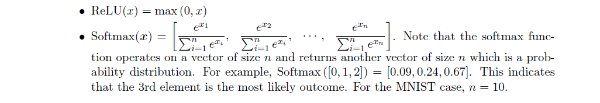

# This is STEP2

## Problem 1: Character recognition using a trained MLP

The purpose of this problem is to have you program, using numpy, the feedforward processing for
a multilayer perceptron (MLP) deep neural network. This processing is dened on slide 33 of the
\introduction" lecture slides. The grading of this homework will give you feedback on your FF
program which is valuable since in a future homework, you will be building on this to program the
back-propagation as well.
The MNIST dataset of handwritten digits is widely used as a beginner dataset for benchmarking
machine learning classiers. It has 784 input features (pixel values in each image) and 10 output
classes representing numbers 0{9. We have trained a MLP on MNIST, with a 784-neuron input
layer, 2 hidden layers of 200 and 100 neurons, and a 10-neuron output layer. The activation
functions used are ReLU for the hidden layers and softmax for the output layer.
(a) Extract the weights and biases of the trained network from mnist_network_params.hdf5.
The le has 6 keys corresponding to numpy arrays W1, b1, W2, b2, W3, b3. You may want
to check their dimensions by using the `shape' attribute of a numpy array.
(b) The le mnist_testdata.hdf5 contains 10,000 images in the key `xdata' and their corre-
sponding labels in the key `ydata'. Extract these. Note that each image is 784-dimensional
and each label is one-hot 10-dimensional. So if the label for an image is [0; 0; 0; 1; 0; 0; 0; 0; 0; 0],
it means the image depicts a 3.
(c) Write functions for calculating ReLU and softmax. These are given as:

